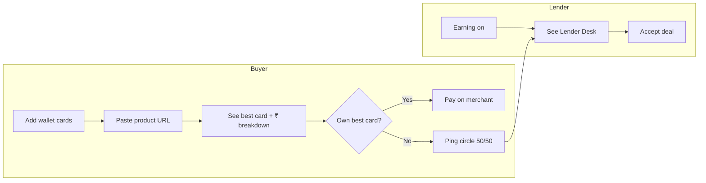

# Product overview

## What is PoolPay?

PoolPay is a **mobile-first PWA** that helps people in India save money on online purchases by:

1. Using the **right credit card** for each merchant (Amazon, Flipkart, travel OTAs).
2. **Pooling** a friend's card from a trusted circle when you do not own the best card — with a **50% cashback split**.
3. **Lending** your card to the circle (Lender Desk) and earning **platform credits**.

It is **not** a payment gateway. Users still pay on Amazon/Flipkart/etc. PoolPay advises, matches, and coordinates **contracts** (pings) between buyers and lenders.

---

## Problem we solve

| Without PoolPay | With PoolPay |
|-----------------|--------------|
| User buys on Amazon with a generic card | App says: use ICICI Amazon Pay → save ₹13,100 |
| User does not have that card | Shows circle friend's card + **50% split** math |
| User wants the card long-term | **Apply now** → in-app lead form to bank |
| Friend has the card | Friend toggles **Earning on** → accepts ping on Lender Desk |

---

## Personas

| Persona | Goal |
|---------|------|
| **Buyer** | Minimize effective price on a specific product URL |
| **Lender** | Earn platform credits by letting circle use their card |
| **Applicant** | Get a new card from teaser / viral feed |

---

## Main user journeys

See [user-stories.md](./user-stories.md) for narrative examples.

---

## Tabs (navigation)

| Tab | Primary purpose |
|-----|-----------------|
| **Home** | Deal finder + stats |
| **Wallet** | Card arsenal + earning toggle |
| **Deals** | Lender Desk + viral price drops |
| **Activity** | Contract history |

---

## What is calculated vs configured?

| Feature | Primary source |
|---------|----------------|
| Deal ranking | **AI** + **Serper** overrides + **rules** fallback |
| Exact ₹ discount | **Formula** (price × %, capped) in `lib/deal-offer-breakdown.ts` |
| Card T&C bullets | **Static catalog** `lib/card-offer-terms.ts` + optional AI/Serper lines |
| 50/50 split | **Formula** `POOL_SPLIT_RATIO = 0.5` |
| Viral products | **Serper Shopping** API |
| Missing card teasers | **Catalog rules** + Serper % |
| Platform credits (lender) | **Formula** 15% of card discount, min ₹99 |
| Trust score | **DB** `profiles.trust_score` (default 100) |
| Home stats | **DB** columns or 0 if missing |

Details: [../04-calculations/README.md](../04-calculations/README.md).
