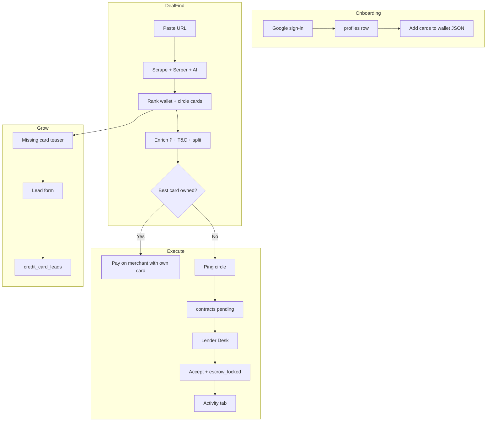

# Data flow — end to end

---

## Data stores touched

| Action | Tables / storage |
|--------|------------------|
| Wallet save | `profiles.cards` |
| Deal search | None (stateless API) |
| Ping | `contracts` |
| Accept | `contracts`, `transactions` |
| Lead | `credit_card_leads`, storage |
| Stats | `profiles` columns |

---

## External calls per deal search

1. Merchant URL fetch (Cheerio)
2. Serper (2–4 queries typical)
3. LLM (1 call if keys present)

Cache: none currently — each search is live.
