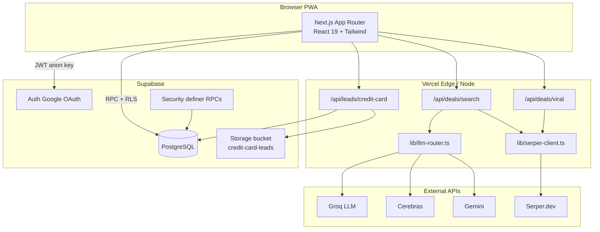
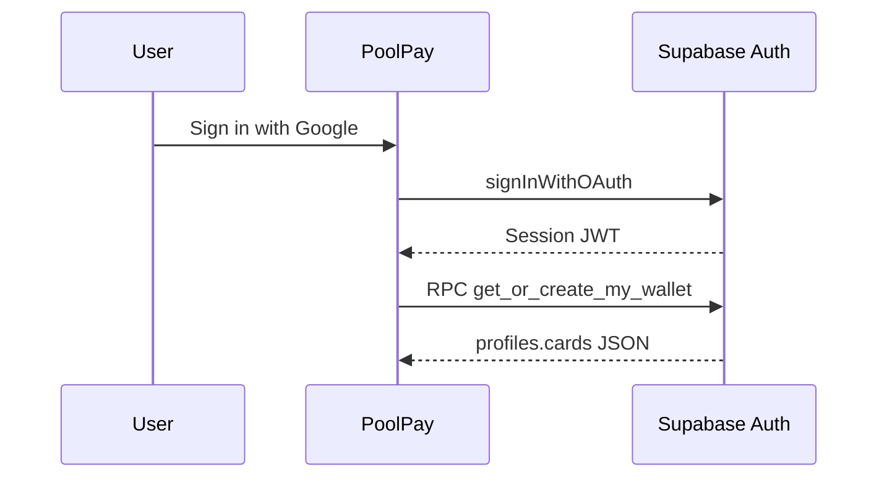
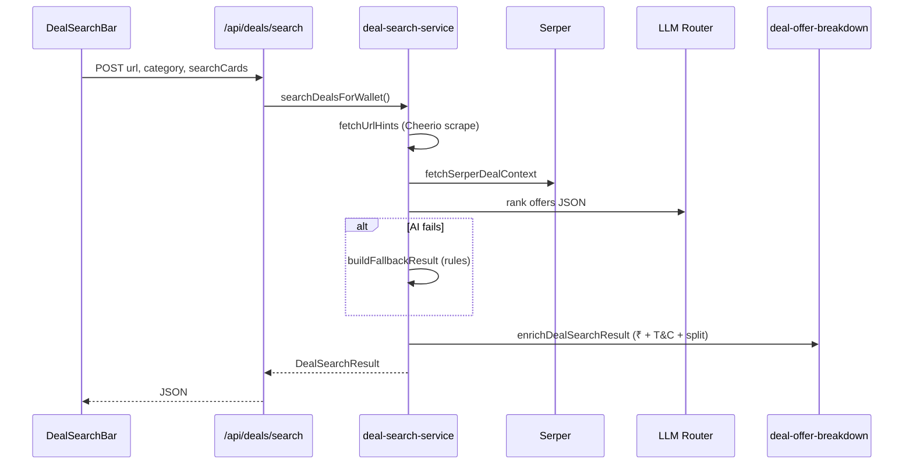

# System architecture (bird's-eye view)

## High-level diagram

---

## Layer responsibilities

| Layer | Responsibility |
|-------|----------------|
| **UI** (`components/`, `app/`) | Auth state, forms, tabs, no secret keys |
| **Hooks** (`hooks/`) | Wallet load, circle cards merge, profile |
| **Lib** (`lib/`) | Deal ranking, breakdown, Serper, LLM, validation |
| **API routes** | Server-only keys, long-running search (30–45s) |
| **Supabase** | Source of truth: profiles, contracts, leads |

---

## Auth flow

Google OAuth is configured in Supabase Dashboard → Authentication → Providers.

---

## Deal search pipeline

---

## Security model

| Asset | Protection |
|-------|------------|
| User wallet cards | RLS on `profiles` + RPC `upsert_my_wallet` |
| Contracts | RLS: buyer/lender + pending visible to authenticated |
| Leads + PDFs | RLS + storage policies; API uses service role for admin paths |
| API keys | Only on server (`SERPER_KEYS`, `GROQ_KEYS`, etc.) |

Never expose `SUPABASE_SERVICE_ROLE_KEY` to the client.

---

## Deployment

- **Git push to `main`** → Vercel auto-build (`next build`)
- Env vars set in Vercel project settings (mirror `.env.local`)

See [../07-setup/deployment.md](../07-setup/deployment.md).
