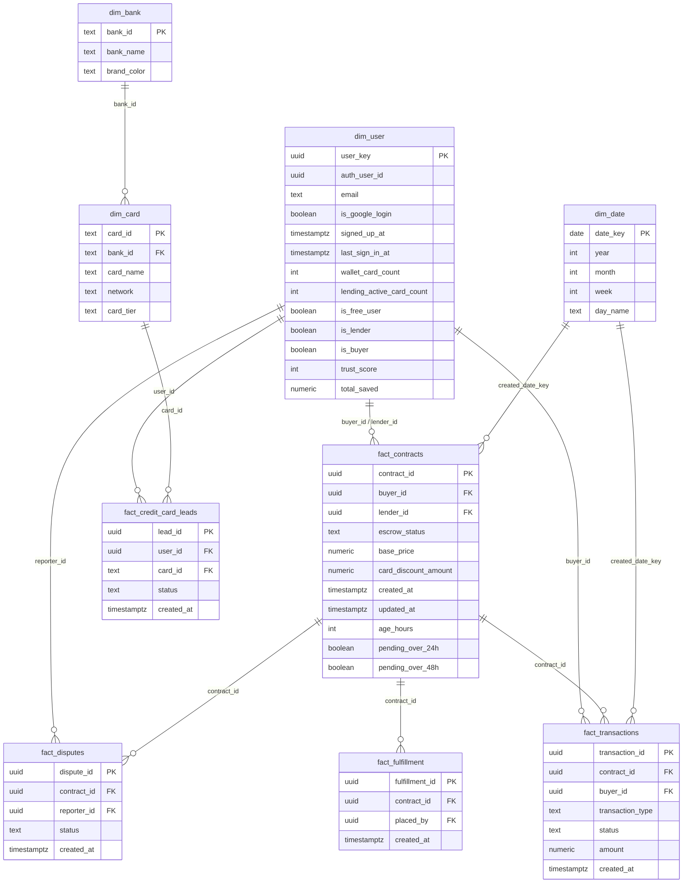

# PoolPay Analytics — Semantic Layer

Star-schema semantic layer for dashboards (Metabase, Supabase charts, or `/admin/dashboard`).

## Entity-relationship (facts ⋈ dimensions)



## Join keys (always use these)

| Fact table | Dimension | Join key |
|------------|-----------|----------|
| `fact_contracts` | `dim_user` (buyer) | `fact_contracts.buyer_id = dim_user.auth_user_id` |
| `fact_contracts` | `dim_user` (lender) | `fact_contracts.lender_id = dim_user.auth_user_id` |
| `fact_contracts` | `dim_date` | `date(fact_contracts.created_at) = dim_date.date_key` |
| `fact_transactions` | `fact_contracts` | `fact_transactions.contract_id = fact_contracts.contract_id` |
| `fact_transactions` | `dim_user` | `fact_transactions.buyer_id = dim_user.auth_user_id` |
| `fact_credit_card_leads` | `dim_user` | `fact_credit_card_leads.user_id = dim_user.auth_user_id` |
| `fact_credit_card_leads` | `dim_card` | `fact_credit_card_leads.card_id = dim_card.card_id` |
| `dim_card` | `dim_bank` | `dim_card.bank_id = dim_bank.bank_id` |

---

## Funnel 1 — User lifecycle

| Stage | Business definition | SQL filter |
|-------|---------------------|------------|
| **1. Google login** | Signed up / signed in via Google OAuth | `auth.identities.provider = 'google'` |
| **2. Added card** | At least one card in wallet | `jsonb_array_length(profiles.cards) > 0` |
| **3. Active buyer** | Created at least one contract ping | `EXISTS (SELECT 1 FROM contracts WHERE buyer_id = user)` |
| **4. Free user** | Buys for self, never lends | Has cards + buyer + **no** `active_for_lending` card + never `lender_id` on contracts |

### Free user (revenue segment)

A **free user** for PoolPay is someone who:

1. Has added at least one card to wallet
2. Has requested at least one deal purchase (contract as `buyer_id`)
3. Has **zero** cards with `active_for_lending = true`
4. Has **never** been assigned as `lender_id` on any contract

They consume circle/deal value but do not supply lending capacity.

### Conversion rates

```
google_to_card_pct     = users_with_card / google_users
card_to_buyer_pct      = buyers / users_with_card
buyer_to_free_user_pct = free_users / buyers
```

---

## Funnel 2 — Contract lifecycle

| Stage | Maps to `escrow_status` | Notes |
|-------|-------------------------|-------|
| **Requested** | Any row in `contracts` | Ping sent at `created_at` |
| **Pending approval** | `pending_acceptance` | `lender_id IS NULL` |
| **Approved** | `escrow_locked`, `order_placed`, `completed` | Lender accepted (`lender_id IS NOT NULL`) |
| **Pending > 24h** | `pending_acceptance` AND `created_at < now() - 24h` | SLA breach tier 1 |
| **Pending > 48h** | `pending_acceptance` AND `created_at < now() - 48h` | SLA breach tier 2 |

### Contract conversion rates

```
approval_rate        = approved_count / requested_count
pending_24h_rate     = pending_over_24h / pending_count
pending_48h_rate     = pending_over_48h / pending_count
avg_hours_to_accept  = avg(updated_at - created_at) WHERE escrow_status != 'pending_acceptance'
```

---

## Dashboard KPIs (recommended tiles)

| KPI | Source |
|-----|--------|
| Google sign-ups (7d) | `dim_user` WHERE `is_google_login` |
| Users with wallet cards | `wallet_card_count > 0` |
| Free users | `is_free_user = true` |
| Lenders (earning mode) | `lending_active_card_count > 0` OR `is_lender` |
| Contracts requested (7d) | `fact_contracts.created_at` |
| Pending approval | `escrow_status = 'pending_acceptance'` |
| Pending > 24h / 48h | `pending_over_24h` / `pending_over_48h` flags |
| Escrow locked (₹) | `SUM(base_price - card_discount_amount)` WHERE `escrow_locked` |
| Card apply leads | `fact_credit_card_leads` by `status` |

---

## Implementation

Run **`supabase/analytics_semantic_layer.sql`** in Supabase SQL Editor after core schema.

Views created:

- `analytics.dim_user` — user dimension with funnel flags
- `analytics.fact_contracts` — contract facts with SLA flags
- `analytics.fact_transactions`
- `analytics.fact_credit_card_leads`
- `analytics.v_user_funnel` — aggregated user funnel counts
- `analytics.v_contract_funnel` — aggregated contract funnel counts

Grant read to service role / founder admin only (contains PII joins via auth).
